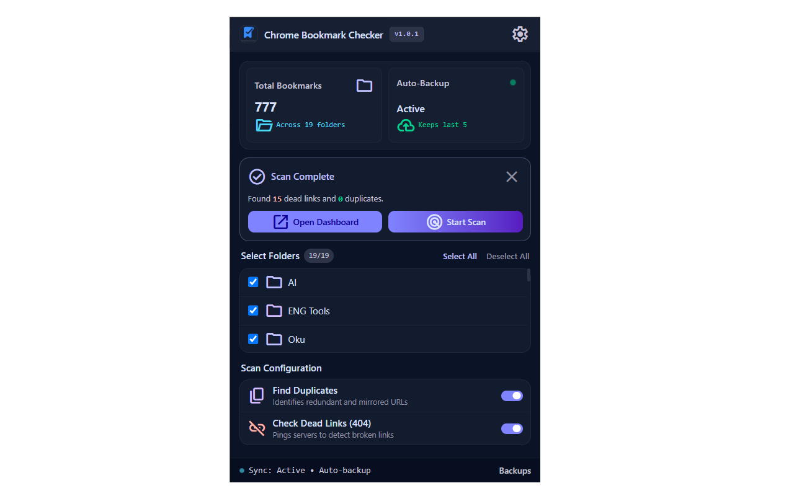
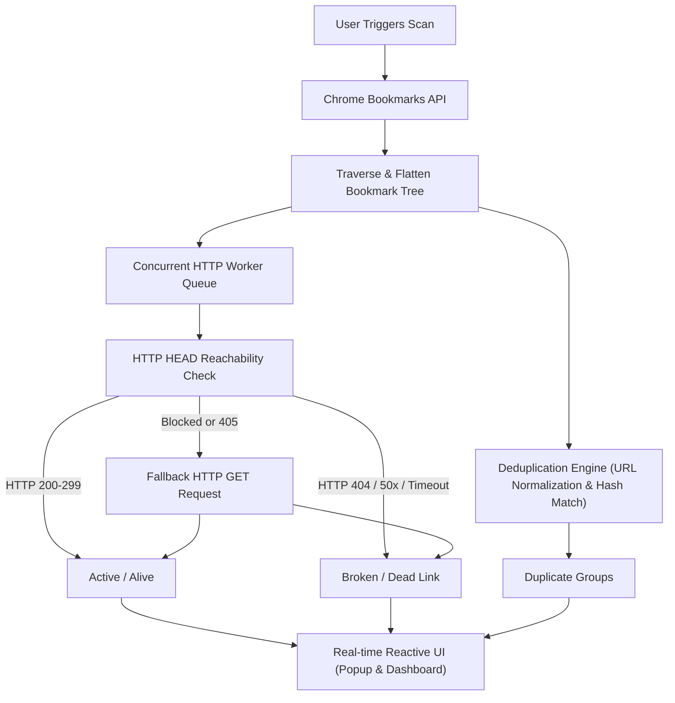

<div align="center">

  

  # Chrome Bookmark Checker

  **A fast, modern, privacy-first Google Chrome extension (Manifest V3) to scan, validate, and organize bookmarks.**

  [](https://github.com/onurb120/ChromePluginBookmarkChecker/actions/workflows/ci.yml)
  [](https://github.com/onurb120/ChromePluginBookmarkChecker/actions/workflows/codeql.yml)
  [](https://developer.chrome.com/docs/extensions/mv3/intro/)
  [](https://react.dev)
  [](https://vitejs.dev)
  [](https://tailwindcss.com)
  [](LICENSE)
  [](#-privacy--security-first)

  <p>
    <a href="#-preview">Preview</a> •
    <a href="#-key-features">Key Features</a> •
    <a href="#-architecture">Architecture</a> •
    <a href="#-how-it-works">How It Works</a> •
    <a href="#-getting-started">Getting Started</a> •
    <a href="#-frequently-asked-questions">FAQ</a> •
    <a href="#-contributing">Contributing</a>
  </p>

</div>

---

## 📸 Preview

<div align="center">
  
</div>

---

## ✨ Key Features

| Feature | Description |
| :--- | :--- |
| 🔍 **Broken Link Detection** | Performs concurrent HTTP HEAD/GET validations against saved bookmarks to detect 404s, 50x server errors, and network timeouts. |
| 📑 **Intelligent Deduplication** | Identifies exact duplicates and normalized URL matches (handling trailing slashes, protocol shifts, and anchor variations). |
| ⚡ **Dual Experience** | Quick toolbar popup for instant checks and an expanded full-page Dashboard for advanced bulk management. |
| 🧹 **Batch Management** | Easily inspect, review, and delete broken or duplicate bookmarks in bulk with real-time feedback. |
| 🛡️ **Zero Telemetry** | 100% client-side execution. No tracking, no analytical beacons, and zero third-party server transmissions. |

---

## 🏗️ Architecture

The extension is powered by **Vite** with `@crxjs/vite-plugin` and **React 19**, structured into clear, decoupled components:

```text
ChromePluginBookmarkChecker/
├── manifest.json              # Chrome Extension Manifest V3 configuration
├── scripts/
│   └── package_extension.ps1  # Automated store-ready production ZIP packager
├── src/
│   ├── index.html             # Quick Popup HTML container
│   ├── main.jsx               # Quick Popup React entry point
│   ├── App.jsx                # Popup UI layout and compact scan controls
│   ├── dashboard.html         # Full-page Dashboard HTML container
│   ├── dashboard.jsx          # Dashboard React entry point
│   ├── DashboardApp.jsx       # Full-screen dashboard with filtering table
│   ├── background.js          # Service worker for background scheduling & alarms
│   ├── index.css              # Tailwind CSS v4 layers and theme definitions
│   └── utils/
│       └── bookmarkUtils.js   # Link checking, normalization & deduplication algorithms
└── tests/
    └── bookmarkUtils.test.js  # Vitest unit test suite
```

---

## ⚙️ How It Works

The following pipeline illustrates how bookmarks are retrieved, verified concurrently, and classified without transmitting any data externally:



---

## 🚀 Getting Started

### Prerequisites

- [Node.js](https://nodejs.org/) (v20 or higher recommended)
- [Google Chrome](https://www.google.com/chrome/) or any Chromium-based browser

### Installation & Development

1. **Clone the repository:**
   ```bash
   git clone https://github.com/onurb120/ChromePluginBookmarkChecker.git
   cd ChromePluginBookmarkChecker
   ```

2. **Install dependencies:**
   ```bash
   npm install
   ```

3. **Start local development with hot reload:**
   ```bash
   npm run dev
   ```

4. **Build production bundle:**
   ```bash
   npm run build
   ```

5. **Run test suite:**
   ```bash
   npm test
   ```

### Loading into Chrome

1. Open Chrome and navigate to `chrome://extensions`.
2. Toggle **Developer mode** in the top-right corner.
3. Click **Load unpacked**.
4. Select the `dist/` directory generated in the repository root.
5. Pin **Chrome Bookmark Checker** to your extension toolbar.

---

## 📦 Packaging & Distribution

To create a clean, compliant distribution package for the Chrome Web Store:

1. Run the automated packager:
   ```bash
   npm run package
   # or directly:
   .\scripts\package_extension.ps1
   ```
2. The standalone ZIP is generated at:
   ```text
   dist/chrome-bookmark-checker.zip
   ```
3. Upload the resulting ZIP to the [Chrome Web Store Developer Dashboard](https://chrome.google.com/webstore/devconsole).

*(Automated release workflows will also bundle and attach this archive whenever a version tag like `v1.0.x` is pushed to GitHub).*

---

## ❓ Frequently Asked Questions

<details>
<summary><b>Does this extension send my bookmarks to any external server?</b></summary>
<br>
<b>No.</b> Chrome Bookmark Checker operates strictly on a zero-telemetry architecture. Bookmark traversal, HTTP connectivity checks, duplicate comparisons, and local preference storage execute 100% inside your local browser context.
</details>

<details>
<summary><b>Why do some bookmarks report 403 Forbidden or Timeout errors?</b></summary>
<br>
Certain websites (e.g., sites behind Cloudflare, anti-bot shields, or login barriers) block automated <code>HEAD</code> inspection or require active session cookies. The extension attempts a <code>GET</code> fallback with a reasonable timeout, but if the server refuses requests without browser challenge verification, it is flagged for user review.
</details>

<details>
<summary><b>How are duplicate bookmarks identified?</b></summary>
<br>
The engine applies URL normalization rules—stripping tracking parameters, harmonizing protocol schemes (<code>http</code> vs <code>https</code>), and standardizing trailing slashes—to accurately flag identical destinations saved multiple times.
</details>

<details>
<summary><b>Can deleted bookmarks be recovered?</b></summary>
<br>
Chrome does not provide a native trash/undo API for bookmarks. For safety, it is always recommended to create a bookmark backup via Chrome Bookmark Manager (<code>chrome://bookmarks</code> &rarr; three dots menu &rarr; <i>Export bookmarks</i>) prior to large batch cleanups.
</details>

---

## 🔒 Privacy & Security First

- **Zero Remote Execution:** Conforms strictly to Manifest V3 policy — no `eval()`, `new Function()`, or injected external scripts.
- **Local Context Only:** Bookmark tree inspection and HTTP reachability checks happen directly in the user's browser sandbox.
- **Automated Scanning:** Every commit and pull request runs automated security audits (`npm audit`) and SAST analysis via GitHub CodeQL.

---

## 🤝 Contributing

Contributions are welcome! Please check out our [Contributing Guidelines](.github/CONTRIBUTING.md) and adhere to the [Code of Conduct](.github/CODE_OF_CONDUCT.md).

For vulnerability reports, please review our [Security Policy](.github/SECURITY.md).

---

## 📄 License

Distributed under the [MIT License](LICENSE).
